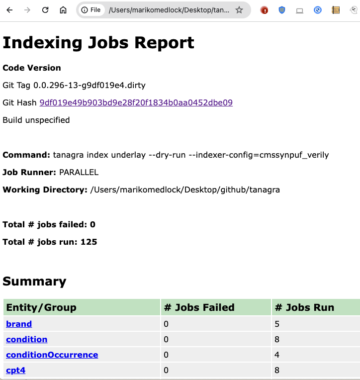

# Codebase Overview

Below is an outline of the project structure. More details in the subsections below.

```
tanagra
    .github              # GitHub actions
    annotationProcessor  # Annotation processor entry point
    buildSrc             # Shared gradle build files
    cli                  # CLI utilities
    client               # Client library generator
    docs                 # Documentation
    gradle               # Gradle executable and linting configs
    indexer              # Indexer
    service              # Service API
    ui                   # UI
    underlay             # Underlay config and query engine
```

## GitHub actions
**`.github` top-level directory**

We use GitHub actions to run tests on each PR before merging. The action definitions and helper scripts live here.

## Annotation processor entry point
**`annotationProcessor` Gradle sub-project**

We use a custom Java annotation processor to generate:
- Markdown documentation for the service application/deployment properties.
- Markdown documentation for the underlay config properties.
- Typescript declarations for the underlay config classes.

The code that actually walks the annotations and generates the Markdown or Typescript lives in the `underlay` project's
`bio.terra.tanagra.annotation` package.

This `annotationProcessor` project provides:
- The Java `main` method to run the processor. We did not want to include this in the `underlay` project because that 
would mean multiple possible entry points to any dependent projects (i.e. `service`, `indexer`). That caused some build 
confusion, especially with AppEngine. Putting the `main` method here instead lets us stick to one `main` entrypoint per 
Gradle project and keeps the build logic simpler.
- The list of classes to process annotations for. Defining these classes requires dependencies on both the `service`
and `underlay` projects. We could not make the `underlay` project dependent on the `service` project because that would
be a circular dependency.

## Shared Gradle build files
**`buildSrc` Gradle sub-project**

`buildSrc` is a [special Gradle project name](https://docs.gradle.org/current/userguide/organizing_gradle_projects.html#sec:build_sources) 
that is applied to all other projects in the build.

## CLI utilities
**`cli` Gradle sub-project**

The indexer has a CLI frontend for kicking off jobs. Generic CLI utilities, mostly pulled from the 
[Terra CLI](https://github.com/DataBiosphere/terra-cli) codebase, live in this `cli` project. There is nothing 
Tanagra-specific in this project, it's more of an internal library. We could pull this out into any actual library if 
it's ever useful somewhere else.

## Client library generator
**`client` Gradle sub-project**

Gradle build logic to generate the service client library for Java, using OpenAPI and Swagger codegen.

## Documentation
**`docs` top-level directory**

All documentation lives here, manually written at the top-level, generated in the `generated` directory. The custom
annotation processor generates markdown for the service application/deployment as markdown. A 
[`picocli`](https://picocli.info/) utility generates `AsciiDoc` files for the indexer CLI manpage. GitHub renders both 
formats.

## Gradle executable and linting configs
**`gradle` top-level directory**

The Gradle version is specified here, along with config files for the various linting plugins we use: `checkstyle`,
`spotbugs`, `pmd`.

## Indexer
**`indexer` Gradle sub-project**

Below is an outline of the package structure. More details in the subsections below.
```
bio.terra.tanagra.indexing
    cli              # CLI frontend
    job              # Job definitions
    jobexecutor      # Job executors
    jobresultwriter  # Job result writers
```

### CLI frontend
**`indexer` Gradle sub-project `cli` package**

Command and option definitions live in the `cli` pacakge. These are the entry points to the indexer. They call the 
`JobSequencer` class to get the set of jobs to run, and pass that to the specified `JobExecutor`.

When adding new commands and options, alphabetize commands and prefer options over positional command arguments.

### Job definitions
**`indexer` Gradle sub-project `job` package**

Job definitions, organized by package according to the main technology they use:
- `bigquery` jobs use only BigQuery. 
  - They typically construct a table schema and create the table, or construct one or more SQL queries and run them to 
  update an existing table.
- `dataflow` jobs use Dataflow and BigQuery.
  - Dataflow jobs can only insert new rows, not update existing ones. So a common pattern for these jobs is to write a 
  temp table with the results of a Dataflow job, then run a SQL query to update another table from the temp table.
  - All Dataflow logic should be factored out to a utility class in the `dataflow.beam` package, and tested separately.

When adding new conditional indexing logic (i.e. controlled by a flag in the underlay config), prefer writing a new 
job that the `JobSequencer` conditionally includes in the job set, over adding logic to an existing job that is
conditionally executed.

### Job executors
**`indexer` Gradle sub-project `jobexecutor` package**

Each indexing job is run in a dedicated thread. This package contains the logic for kicking off and waiting for the 
threads to finish. There are currently two supported executors: serial and parallel. Parallel is the default and
recommended wherever possible. Serial can be useful for debugging.

Jobs are run in stages. All jobs in a single stage can be run in parallel. We wait for all jobs in a stage to complete
before kicking off any jobs in the next stage. A `SequencedJobSet` defines a set of jobs and stages to run. The
`JobSequencer` builds the job sets for entities and entity groups, based on the underlay config files.

### Job result writers
**`indexer` Gradle sub-project `jobresultwriter` package**

After all indexing jobs in a set are run, we output the results. Different output writers live in this package. The
`HtmlWriter` is the only one currently in use.



## Service API
**`service` Gradle sub-project**

Below is an outline of the project structure. More details in the subsections below.
```
local-dev               # Utilities for local development
bio.terra.tanagra
    app                 # API entry points and application configuration
    db                  # Application database
    service
      accesscontrol     # Access control
      artifact          # API artifacts
      authentication    # Authentication
      export            # Data export
```

### Utilities for local development
**`service` Gradle sub-project `local-dev` directory**

Helper scripts for running the service locally live in this directory.

### API entry points and application configuration
**`service` Gradle sub-project `app` package**

Classes related to OpenAPI and SpringBoot web framework live in this package.
- All application/deployment configuration properties are defined in the `configuration` package. Each new property 
should include an annotation that will be used to generate documentation.
- All API endpoints map to a method in one of the `controller` package classes. The endpoints are defined in the
OpenAPI specification file in the `resources/api` directory.

### Application database
**`service` Gradle sub-project `db` package**

The application database stores the service state (e.g. a user's cohorts). We support PostGres, MariaDB, and MySQL.
We use Liquibase to manage the database schema; the changeset files live in the `resources/db` directory.

### Access control
**`service` Gradle sub-project `accesscontrol` package**

Access control/authorization is configurable per deployment. The various access control implementations, and the 
interface they share live in this package. More information in [this readme](./ACCESS_CONTROL.md).

### API artifacts
**`service` Gradle sub-project `artifact` package**

Artifacts that are exposed through the API include studies, cohorts, reviews, concept sets, and activity logs. These
artifacts are part of the application persistent state and stored in the application database.

When adding a new artifact or logic to an existing one, prefer defining a POJO-like model class and putting logic into
the associated service or dao classes.

### Authentication
**`service` Gradle sub-project `authentication` package**

We support three types of authentication tokens: GCP access token, JWT from IAP in front of GKE, JWT from IAP in
front of AppEngine. Utilities for processing these tokens lives in this package.

### Data export
**`service` Gradle sub-project `export` package**

Data export models are configurable per deployment. The various data export implementations, and the interface they
share live in this package. More information in [this readme](./DATA_EXPORT.md).

## UI
**`ui` top-level directory**

Web UI code. More information in [this readme](./UI.md).

## Underlay config and query engine
**`underlay` Gradle sub-project**

Below is an outline of the project structure. More details in the subsections below.
```
bio.terra.tanagra
    annotation  # Annotation processor
    api         # Entity query API
    exception   # Shared exceptions
    query       # API query translator
    underlay    # Underlay
```

### Annotation processor
**`underlay` Gradle sub-project `annotation` package**

We use a custom Java annotation processor to generate:
- Markdown documentation for the service application/deployment properties.
- Markdown documentation for the underlay config properties.
- Typescript declarations for the underlay config classes.

The custom annotation definitions and the code that walks a class' fields by reflection lives here. The entry point
that calls this code lives in the [`annotationProcessor`](#annotation-processor-entry-point) Gradle sub-project.

### Entity query API
**`underlay` Gradle sub-project `api` package**

We define an entity query API over Tanagra's entity model that is available to both the `indexer` and `service`.
More information about the entity model in [this readme](./ENTITY_MODEL.md).

There are 4 types of queries:
  - `list` queries are used to list entity instances (e.g. list of conditions that match a text search, list of
condition occurrences that match a cohort).
  - `count` queries are used for cohort breakdowns (e.g. count the number of people with a criteria, broken down by 
gender).
  - `export` queries are used for data export (e.g. export the demographic information for a cohort).
  - `hint` queries are used by the UI for display hints (e.g. age range slider, list of possible genders).

The `list`, `count`, and `export` queries include:
- A set of entity fields that you want returned. This corresponds to the `SELECT` part of a SQL query.
- An optional entity filter that you want applied. This corresponds to the `WHERE` and `HAVING` parts of a SQL query.

The OpenAPI query endpoints in the service closely match this internal API, but they are not enforced to be the
same. We typically add new features to the internal query API first, and expose them through the service as needed.

### Shared exceptions
**`underlay` Gradle sub-project `exception` package**

Shared exception classes live here. Extend a `bio.terra.common.exception` class if possible, so that if they are
thrown during service operation, they map to a sensible HTTP error code.

### API query translator
**`underlay` Gradle sub-project `query` package**

A `QueryRunner` implementation takes an entity query, translates it into something that can be run, runs it, and maps
the results back to the entity model. Currently, the only implementation translates the entity query in BigQuery-valid
SQL and runs it. To support a new dataset index storage backend (e.g. ElasticSearch, PostGres) or different SQL
translation logic (e.g. use JOINs instead of SELECT INs), we would add a new `QueryRunner` implementation here. 

The `BQQueryRunner` generates BigQuery-valid SQL. A lot of this is generically valid SQL, there are only some 
BigQuery-specific parts. Most of the generic SQL translation is factored out into the `sql` package for easier reuse in
the future.

### Underlay
**`underlay` Gradle sub-project `underlay` package**

An underlay is a dataset + Tanagra configuration.

There are 4 views over or ways to think about an underlay.
- Set of entities and entity groups. These classes live in the `entitymodel` sub-package. More information about the 
entity model in [this readme](./ENTITY_MODEL.md).
- Set of config files defined by the user. The classes that define the config file schema live in the `serialization`
sub-package. The `ClientConfig` class contains pointers to most of the config files for a particular 
underlay. The config files themselves live in the `resource/config` directory. More information about the config files 
in [this readme](./CONFIG_FILES.md). The config file pointers in this class are passed to the UI via the service API.
- Set of source data tables. The types of source tables are defined by classes in the `sourcetable` sub-package. The
`SourceSchema` class contains pointers to all source tables for a particular underlay.
- Set of index data tables. The types of index tables are defined by classes in the `indextable` sub-package. The 
`IndexSchema` class contains pointers to all index tables for a particular underlay.

An instance of the `Underlay` class includes a pointers to all of the above: entity model objects, config files,
source tables, and index tables. The `indexer` and `service` both use multiple views over an underlay, depending on the 
situation. For example, the `indexer` defines job sets per entity and entity group (`entitymodel` view), and builds SQL 
queries using the schema of both the source and index tables (`sourcetable` and `indextable` views).

To add a new config property, modify the appropriate class in the `serialization` sub-package. It should then be 
available wherever you need it (e.g. in `service` or `indexer`).
