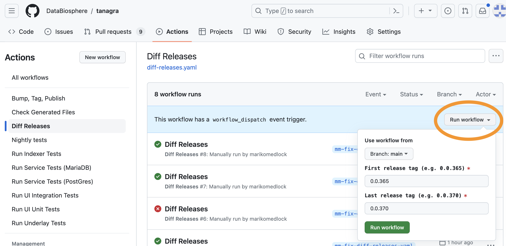

# Diff Release Tags

There is a utility GitHub action for diff-ing two release tags. This is intended to help answer the questions:
1. What's changed since the last time I released?
2. Do I need to re-index?

The utility takes a first and last release tag and generates a file with:
1. A list of all the changes that were merged between those tags, including a brief description and the author.
2. A recommendation about whether to re-index, based on whether any files that could affect indexing were changed.

This is a **blunt instrument**, and intended as a starting point only.
- For more information about any of the individual changes, contact the author.
- The re-indexing recommendation errs on the side of false positives. It will recommend re-indexing if **any** files 
that could affect the indexer changed, even if they wouldn't affect the result (e.g. adding a logging statement to an 
indexing job would trigger a recommendation to re-index).

## Run from GitHub UI
1. Open a web browser and navigate to the `Diff Releases` action [page](https://github.com/DataBiosphere/tanagra/actions/workflows/diff-releases.yaml).
2. Click the gray "Run Workflow" button on the left.

3. Enter the first and last release tags in the text boxes and click the green "Run workflow" button below.
4. Within a couple of minutes, you should see the workflow in progress.
   
5. Once the workflow finishes, it should show a green checkmark. Click on the workflow run to see the results.
6. The output file is linked in the "Artifacts" section. Click on the `diff-file` to download it.
   
7. If the download is a ".zip" file, unzip it to get the ".txt" file inside.
8. Open the output text file in a text editor on your local machine.
   

## Run locally
Running the script from the top-level directory will generate the output ".txt" file in your current working directory.
```
.github/tools/diffReleases.sh 0.0.365 0.0.370
ls -la diffReleases.txt
```
