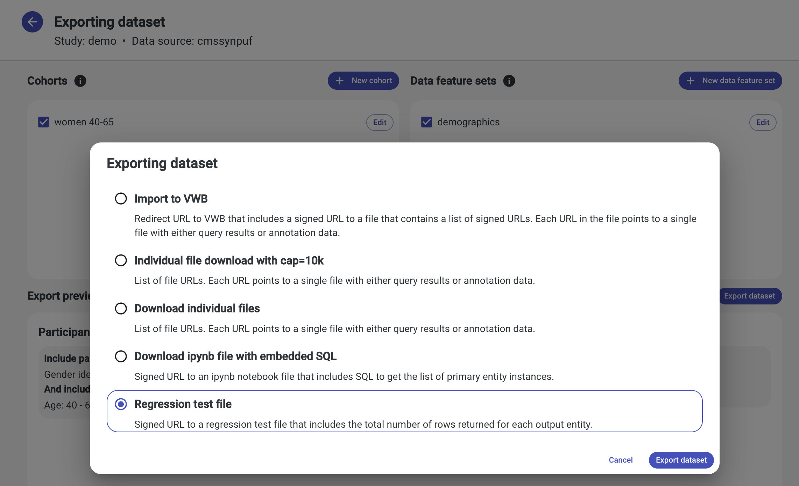

# Regression Testing

## Motivation
Tanagra has a regression testing framework to detect unexpected changes in query results against different underlays.
This is different from the query engine tests we have that validate generated SQL strings. Those tests are very brittle, 
by design, so that we don't make unintentional changes to the generated SQL when e.g. adding support for a new type of 
query. The regression test framework only checks that the query results are the same, regardless of what generated SQL
was used to return them.

This framework is necessary because Tanagra has data dependent code paths. e.g.
  - The same generated SQL can return one row per `person` for one underlay, but multiple rows per `person` for a 
    different underlay, because the cardinality of the relationship between two entities is different.
  - The same generated SQL can return a valid numeric range for underlay, but only a `null` value for a different
    underlay.

Just validating that the generated SQL is as expected doesn't cover these variations in the underlying data.
Instead, we want to actually run the queries against a production or production-like dataset and validate the results.

Most of these data dependent code paths can be broken by changes to any one of the following:
- Query engine code (e.g. expected generated SQL change not behaving as intended across all source datasets).
- Underlay config files (e.g. mapping to the source dataset).
- Criteria plugin code (e.g. configured filter builder returning unexpected filter for certain selection data).
- Underlying dataset (e.g. dataset refresh).

Note that some of these breakages fall under the purview of Tanagra's core codebase (e.g. query engine code), while
others are often managed elsewhere (e.g. dataset refresh). For Tanagra core developers, this framework is useful for
catching data-dependent regressions, that are otherwise difficult to simulate and test. For underlay/dataset 
maintainers, this framework is useful for catching regressions caused by config or underlying data changes.

## Framework overview
For a given underlay/dataset, we generally don't expect query results to change over time. For our purposes, checking
the query counts (i.e. total number of rows returned) is sufficient, and we don't compare the actual rows returned 
(e.g. check that all `person_id`s match). The idea of this framework is that we can preserve a particular set of 
cohort and data feature set definitions, compute the total number of rows they would export per output table, and save 
these definitions and counts to a regression test file. Then we can take those same definitions, recompute the export
row counts with the most recent code, and expect them to match the original.

## Create a new test
Create a new test via the export flow in the UI. You must use a server that has the regression test export option
enabled. We recommend configuring a non-prod deployment to [enable this export option](./DATA_EXPORT.md). It's enabled 
by default if you start a local server using the `./service/local_dev/run_server.sh` script.

1. On the export page, select one or more cohorts and data feature sets.
2. Choose the `Regression Test File` export option.
   
3. Download the generated file to your local computer.
4. Save the generated file in a permanent location that is accessible to your regression test GitHub action runner. e.g.
    - In this DataBiosphere repo's `service/src/test/resources/regression/{underlay name}` subdirectory.
    - In your "downstream" repo.

## Run tests locally
Run tests with a Gradle command. Before kicking off the tests, check that:
- The default application credentials are set to something that has query permissions on the underlays 
you want to test.
```
export GOOGLE_APPLICATION_CREDENTIALS=/path/to/service/account/key/file
```
- The service is configured to serve the underlays you want to test.
```
export TANAGRA_UNDERLAY_FILES=cmssynpuf_broad,aouSR2019q4r4_broad
```

Note that regression tests are not included in the usual `./gradlew test` command; They must be run separately.

How to trigger the tests depends on where your regression test files are stored. Optionally specify a filename filter.
1. In this DataBiosphere repo's `service/src/test/resources/regression/{underlay name}` subdirectory.
    ```
    ./gradlew service:regressionTests -PregressionTestUnderlays=cmssynpuf,aouSR2019q4r4
    ./gradlew service:regressionTests -PregressionTestUnderlays=cmssynpuf -PregressionTestFiles=cohortGenderidentityFEMALE_datafeaturesetDemographics.json
    ```
2. In your "downstream" repo.
    ```
    ./gradlew service:regressionTests -PregressionTestDirs=~/regressionTests/cmssynpuf/,~/regressionTests/aouSR2019q4r4/
    ./gradlew service:regressionTests -PregressionTestDirs=~/regressionTests/cmssynpuf/ -PregressionTestFiles=cohortGenderidentityFEMALE_datafeaturesetDemographics.json
    ```

## Build a test suite
When building a regression test suite for a particular underlay/dataset, we recommend covering the various criteria 
plugins, because they are configured separately per underlay. e.g.
- One test per cohort criteria type (e.g. blood pressure, gender) without modifiers. Use the demographics data feature 
only.
- One test per cohort criteria type with modifiers, if there are any. Use the demographics data feature only.
- One test per data feature criteria type (e.g. ICD9-CM, weight). Use any cohort.
- **DO NOT INCLUDE** criteria that are runtime-calculated and can change day-to-day (e.g. age) because we expect those
counts to change over time.

We also recommend including tests for any "notable" data, where your underlying dataset may be unique (e.g. a particular
SQL schema or JOIN pattern that we haven't encountered before, or an unusual data range perhaps with many outliers).
This is subjective of course, but the idea is to test data-dependent code paths that are driven by both config and the
underlying data.

## Setup automatic test runs
Ideally, we could run these tests against an artificial/test dataset that is similar in complexity to our production
datasets. Unfortunately, the time investment required to build such a dataset is prohibitive, for now anyway. So we 
need to run these tests against production data. This limits where we can run these tests; Notably, we can't gate PRs 
in this DataBiosphere repo on these tests passing because our GitHub action service account doesn't have access to all
the production datasets. So, we need to be able to run some of these regression tests in this repo (e.g. for public
datasets), and others in "downstream" repos that have access to the production data. Deployments typically have a
"downstream" repo to manage their deployment; That same repo is a good place to run these tests regularly.

We have a [sample GitHub action workflow file](../.github/workflowsForDownstreamRepo/regression-test-downstream-repo.yaml) 
for running these tests in a "downstream" repo. To get this working in your own repository:
- Copy the sample workflow file into your repo's `.github/workflows` directory.
- Modify the sample workflow to specify the service config files that tests should use. This is set by the
  `env.TANAGRA_UNDERLAY_FILES` variable. There must be a service config file for each underlay you want to test.
- Modify the sample workflow to specify the underlays to test by default.
  If your regression test files are stored in this DataBiosphere repo's `service/src/test/resources/regression/{underlay name}` 
  subdirectory, use the underlay names (e.g. `cmssynpuf`). If your regression test files are stored in your "downstream"
  repo, use the directory path (e.g. `~/regressionTests/cmssynpuf/`). You need to update the default in 2 places:
    - The `default` value of the `workflow_dispatch.inputs.underlays` for on-demand runs.
    - The `env.DEFAULT_UNDERLAYS` variable for on-PR (or other triggered) runs.
- If your regression test files are stored in your "downstream" repo, update the name of the Gradle parameter in the 
  run command from `-PregressionTestUnderlays` to `-PregressionTestDirs`.
