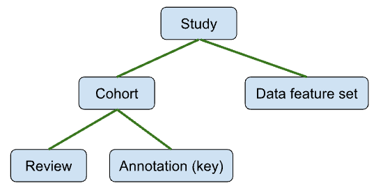
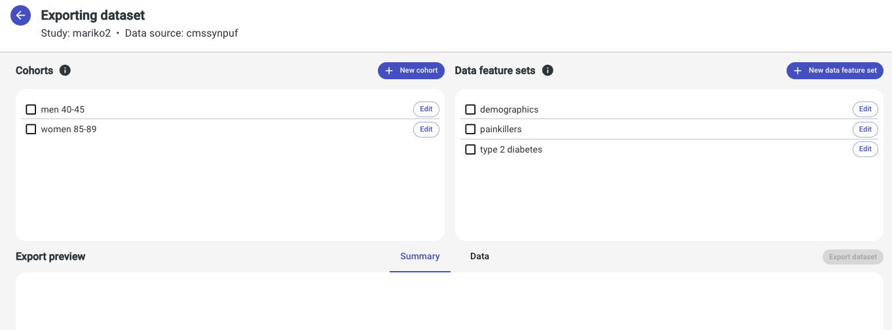
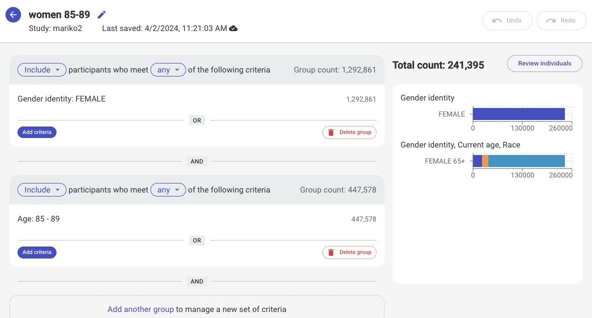
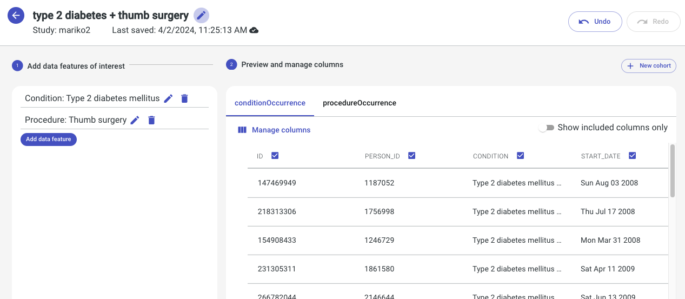
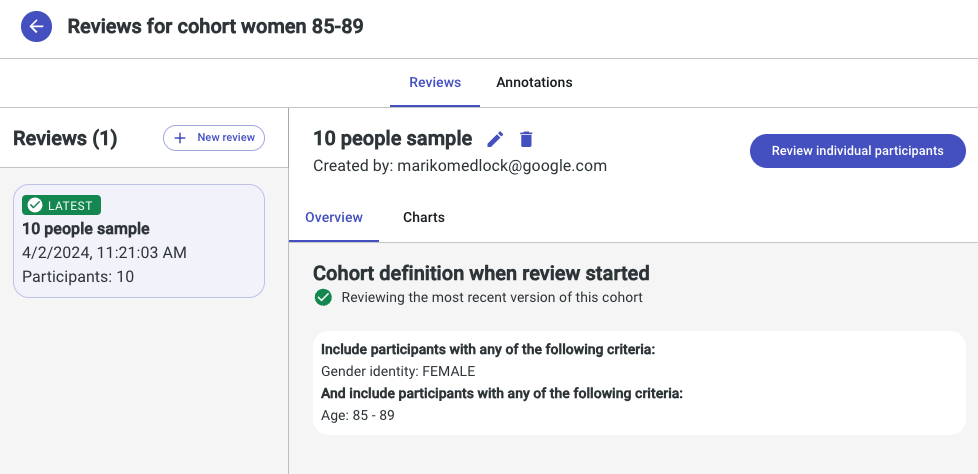
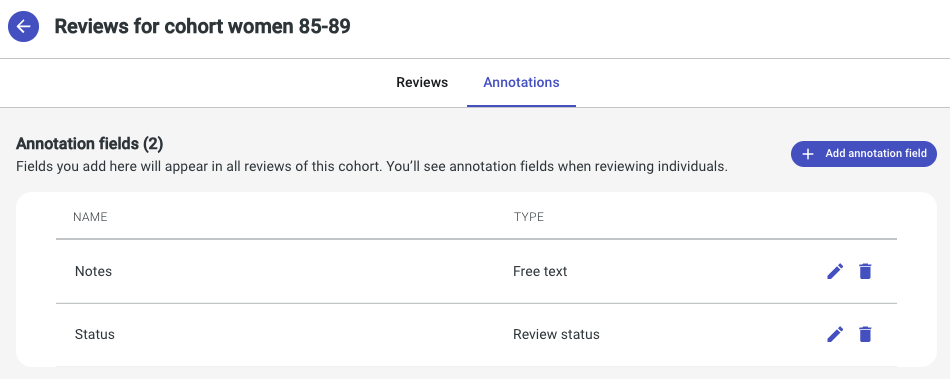
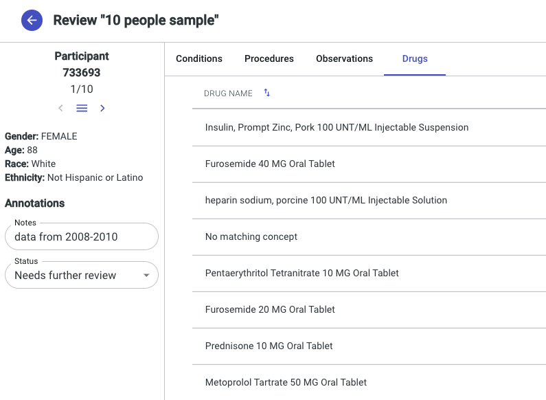

# Service Artifacts

Users can manage various artifacts in Tanagra's UI (e.g. cohort, study).
The backend handles all artifacts in the `service` layer (Gradle sub-project) of the code.
They are part of the application state, stored in the application database (e.g. PostGres).

Most permissions can be controlled for each level of the hierarchy.
In practice, all use cases currently control access either at the study or underlay level.

Below is a diagram of the artifact hierarchy and brief descriptions of each artifact.

## Study
A study is a group of one or more cohorts and data feature sets. It is the top-most artifact in the hierarchy.
A study is not tied to a particular underlay/dataset. So a study can contain cohorts for multiple underlays.

The data export page is based on a study + underlay. The list of cohorts and data feature sets are all
those in the selected study and associated with the selected underlay.

A study is primarily used for organization and/or access control. e.g. A lab organizes all their cohorts and
data feature sets for a particular project into a single study and only grants access to researchers who are
actively working on the project.

## Cohort
A cohort is a subset of the primary entity instances for an underlay/dataset (e.g. subset of persons).
Users define the subset by specifying filter criteria (e.g. gender=female) on the cohort overview page.

The backend stores a cohort as a subset definition, not a "materialized" subset.
e.g. We store gender=female, not the list of all person ids that have gender=female.
A cohort is "materialized" at runtime: when computing counts on the cohort overview page, when exporting, 
when generating a random sample at review creation time.

A cohort can contain one or more reviews and annotation keys.

## Data Feature Set
A data feature set is a subset of the output data for a particular primary entity instance for an underlay/dataset
(e.g. demographic information, drug exposures, diabetes diagnoses for a person).

The backend stores a data feature set as subset definitions for each output entity, not "materialized" subsets.
e.g. We store condition_occurrence for condition=diabetes, not the list of all condition_occurrence ids that have
condition=diabetes.
A data feature set is "materialized" at export time. We export the output data for all primary entity instances in the
selected cohorts. e.g. All demographic information, drug exposures, diabetes diagnoses for people in any of the cohorts.

## Review
A review is a random sample of a particular cohort (e.g. sample of persons).
Users specify the size of the random sample at review creation time.

A review is always a "materialized" sample of a cohort, and the backend stores it that way (e.g. as a list of person ids).

## Annotation (Key)
An annotation (key) is a type of comment users can add to a particular primary entity instance in a review
(e.g. "Notes", "Review Status"). Annotation keys are user-defined at the cohort level. They can be used across all 
reviews for the cohort. At export time, users can export all annotation keys and associated values for all reviews
for a given cohort.

## Activity log
Most user actions are included in the deployment logs (i.e. written to `stdout`, captured in deployment logs).
Certain user actions are also included in the application activity log:
- create/delete a study
- create/delete a cohort
- export a cohort
- create/delete a review
This allows auditing the above actions via the application UI.

The core UI currently only supports an activity log detail page and deployments need to write their own activity
log list page.
