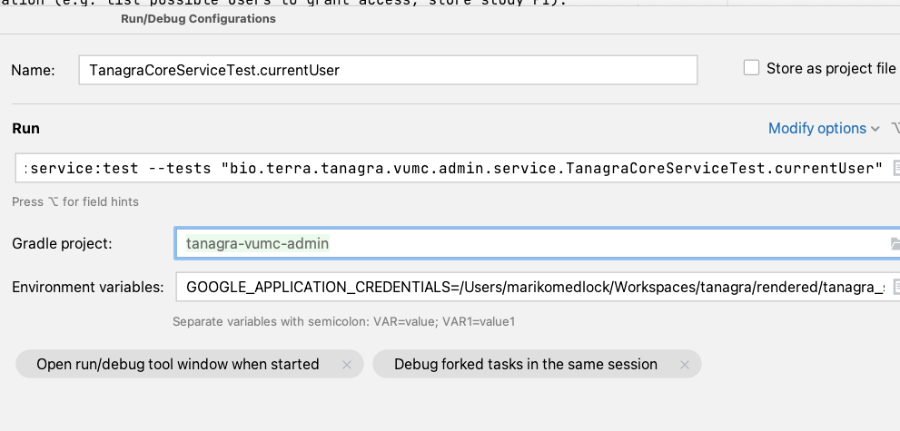

# VUMC Admin Service

## Core + Admin Services
We plan to deploy the [VUMC admin service](https://github.com/DataBiosphere/tanagra-vumc-admin) and the core Tanagra 
service (this repo) together. General outline of what each service is responsible for:
- The core service will handle all data explorer functionality (e.g. build cohorts, export datasets, compute a
  cohort breakdown).
- The admin service will handle access control (e.g. which users have access to which
  studies/artifacts) and any VUMC-specific information (e.g. list possible users to grant access, store study PI).

It's not a hard line though and we expect ongoing discussions around functionality that doesn't fall neatly into
one service or the other.

## Deployments
The `tanagra.vumc-admin` set of configuration properties (in `application.yml` and `application-test.yml`) tell
the core service which admin service deployment to connect to. When developing the core service, it's helpful to have
an admin service to point your local server at, instead of having to mock everything.

Verily's test and dev deployments include both the core and admin services. So currently, these config properties point
to the Verily `dev` environment. This could be changed to point to the Verily `test` environment (values below) or a
VUMC environment in the future.
```
vumc-admin:
  base-path: https://tanagra-vumc-test.api.verily.com
  oauth-client-id: 730051649108-uepfa779jvl5ct2u7thfkqje5gda0ona.apps.googleusercontent.com
  use-adc: true
```

### Authentication
The Verily environments are behind [IAP](https://cloud.google.com/iap) and users need to be explicitly allow-listed
before they can hit any endpoints there. I went ahead and allow-listed a Broad service account for use by this repo's 
GitHub actions that run tests: `tanagra@broad-tanagra-dev.iam.gserviceaccount.com`.

You can run a local core service that talks to an admin service by setting the application default credentials
before kicking off the service:
```
export GOOGLE_APPLICATION_CREDENTIALS=path/to/service/account/key/file.json
./service/local-dev/run_postgres.sh start
./service/local-dev/run_server.sh
```

Tests that talk to the admin service will also need these credentials. You can set them as above and run tests
from the command line.
```
export GOOGLE_APPLICATION_CREDENTIALS=path/to/service/account/key/file.json
./gradlew service:test
```
You can also set the environment variable in an IntelliJ run configuration and run tests from the IDE.

